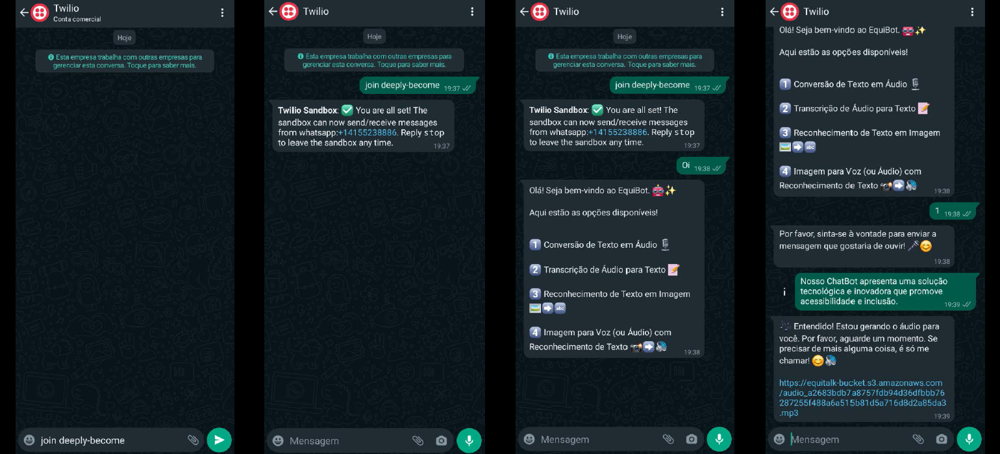
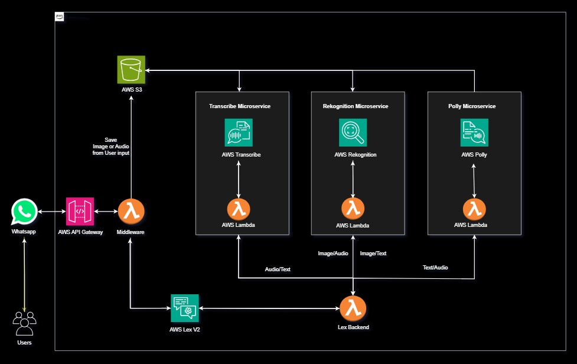

<div align="center">
  <h1>EquiTalk Bot</h1>
</div>

## <p align="center"> Integrantes
<p align = "center">
<a href="https://www.linkedin.com/in/john-marcel-silveira-62530752/"> </a>
<a href="https://www.linkedin.com/in/josu%C3%A9-mendon%C3%A7a-dev77/"> </a>
<a href="https://www.linkedin.com/in/luiz-augusto-scarsi/"> </a>
<a href="https://www.linkedin.com/in/rafamessiaspinheiro/"> </a>
<a href="https://www.linkedin.com/in/yuri-antunes-souza/"> </a>

## <p align="center"> Tecnologias Utilizadas
  <div align="center">
    
    
    
    
    
  </div>

***
## <p align="center"> Recursos AWS  
  <div align="center">
    
    
    
    <br>
  </div>

***

<a name="ancora"></a>

## 📖 Sumário
- [1 - Objetivo](#ancora1)
- [2 - Desenvolvimento do Projeto](#ancora2)
- [3 - Acesso à Aplicação e Como Utilizar](#ancora3)
- [4 - Funcionalidades](#ancora4)
- [5 - Estrutura de Pastas do Projeto](#ancora5)
- [6 - Arquitetura AWS](#ancora6)
- [7 - Dificuldades Conhecidas](#ancora7)
- [8 - Licença](#ancora8)

<a id="ancora1"></a>

# 1 - Objetivo

O principal objetivo do ``EquiTalk`` é criar uma solução tecnológica e inovadora que promove acessibilidade e inclusão. Por meio da integração dos recursos disponibilizados na AWS, nosso ChatBot busca fornecer assistência a pessoas com deficiências auditivas, visuais e linguísticas, bem como àqueles que enfrentam dificuldades na interpretação de informações. 
    
<a id="ancora2"></a>

# 2 - Desenvolvimento do Projeto 
O projeto foi desenvolvido utilizando o serviço de ChatBot <a href=https://aws.amazon.com/pm/lex> ``Lex``</a>, disponibilizado pela AWS, integrado com a plataforma <a href= https://www.twilio.com/docs/whatsapp> ```Twilio```</a>, para utilização através do <a href=https://www.whatsapp.com>``WhatsApp``</a>. <br>
<br>
Além do <a href= https://aws.amazon.com/pm/lex> ``Lex``</a>, também foram utilizados os serviços <a href= https://aws.amazon.com/pm/polly> ``Polly``</a>, <a href= https://aws.amazon.com/pm/transcribe> ``Transcribe``</a> e <a href= https://aws.amazon.com/rekognition> ``Rekognition``</a>, todos disponibilizados pela AWS.<br>
O deploy da aplicação foi relizado através da arquitetura <a href= https://www.serverless.com> ``Serverless``</a>.    

<a id="ancora3"></a>

# 3 - Acesso à Aplicação e Como Utilizar
  
  <div align="center">
    
  </div>

- Leia o QRCode acima;<br> 
- Encaminhe a mensagem padrão de inicializacão do bot;<br>
- Você receberá uma mensagem de confirmação da inicialização do Equitalk;<br>   
- Envie um ``Oi`` para iniciar a conversa com o ``Equitalk``;<br>
- Selecione uma das opções apresentadas no menu, ``1``, ``2``, ``3`` ou ``4``;<br>
 <div align="center">
    
  </div>  

<a id="ancora4"></a>

# 4 - Funcionalidades

* 1 ) Conversão de ``Texto em Áudio`` 📷
  - Envie uma mensagem de texto e é retornado a URL do áudio; 

* 2 ) Transcrição de ``Áudio para Texto`` 🎤
  - Envie uma mensagem de voz e o ``Equitalk`` irá retornar em texto as informações recebidas no áudio;

* 3 ) Reconhecimento de ``Texto em Imagem`` 🖼️➡️🔤
  - Envie uma imagem que contenha o texto a ser transcrito, e receba uma mensagem com o texto reconhecido; 

* 4 ) ``Imagem para Voz`` com reconhecimento de texto 📸➡️🔊
  - Envie uma imagem que contenha o texto a ser transcrito, é retornada a URL de um áudio do texto que continha na imagem;

<a id="ancora5"></a>

# 5 - Estrutura de Pastas do Projeto

```

├── .vscode
│    ├── example.settings.json
│    └── extensions.json
├── assets
|    ├── icons
|    |    ├── aws.png
|    |    └── ...
│    ├── images
│    │    ├── apresentacao.jpeg
│    │    └── ...
├── bot-lex-backend
|    ├── core 
|    |   └── config.js
|    ├── handlers
|    |   ├── imageToSpeech.js
|    |   ├── imageToText.js
|    |   ├── speechToText
|    |   └── textToSpeech.js
|    ├── helper
|    |   └── helper.js
|    ├── .example.env
|    ├── package.json
|    ├── router.js
|    └── serverless.yml  
├── bot-middleware
|    ├── core 
|    |   └── config.js
|    ├── helper
|    |   └── helper.js
|    ├── services
|    |   ├── LexService.js
|    |   ├── S3Service.js
|    |   └── TwilioService.js 
|    └── ...
├── microservices
|    ├── polly
|    |   ├── core
|    |   |  └── config.js
|    |   ├── helper
|    |   |  └── helper.js
|    |   ├── services 
|    |   |  └── PollyService.js
|    |   └── ...
|    ├── rekognition  
|    |   ├── core
|    |   |  └── config.js
|    |   ├── helper
|    |   |  └── helper.js
|    |   ├── services 
|    |   |  └── RekognitionService.js
|    |   └── ...
|    ├── transcribe  
|    |   ├── core
|    |   |  └── config.js
|    |   ├── helper
|    |   |  └── helper.js
|    |   ├── services 
|    |   |  └── TranscribeService.js
|    |   └── ...
├── .gitignore
└── README.md

```

<a id="ancora6"></a>

# 6 - Arquitetura AWS

  <div align="center">
    
  </div>


***

<a id="ancora7"></a>

# 7 - Dificuldades Conhecidas
- Integração `Amazon Lex` com `Twilio`
- Utilização de um `Middleware` para captar imagem e áudio via sdk `Twilio`
- Router de Intents via `Lex-Backend`
- Desacoplar a aplicação fazendo o uso de `Microserviços`

<a id="ancora8"></a>

# 8 - Licença

Este projeto está licenciado sob a Licença MIT - consulte o [Link](https://mit-license.org/) para obter mais detalhes.# EquitalkChatBot
